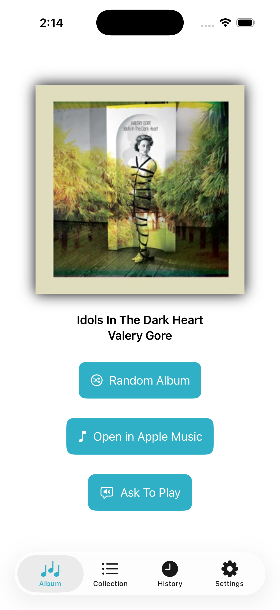
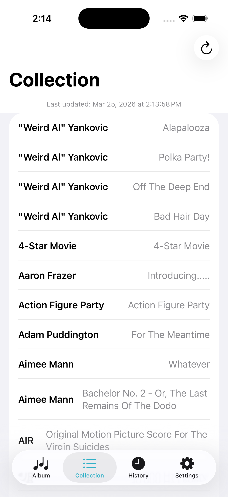
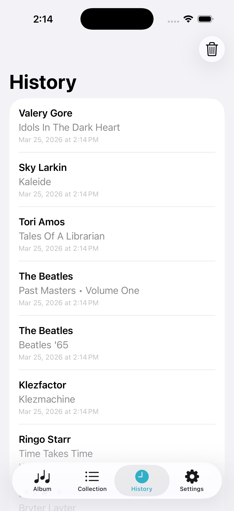
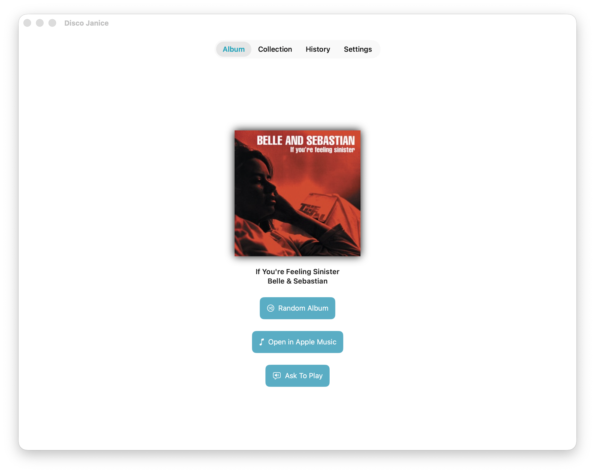
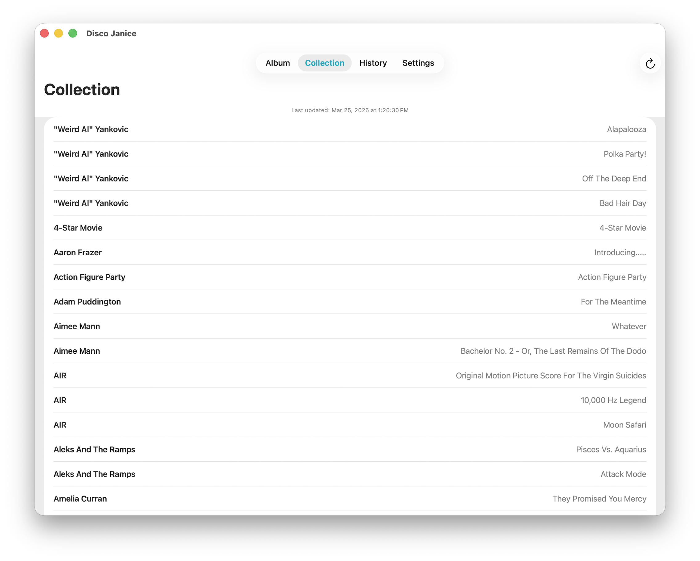
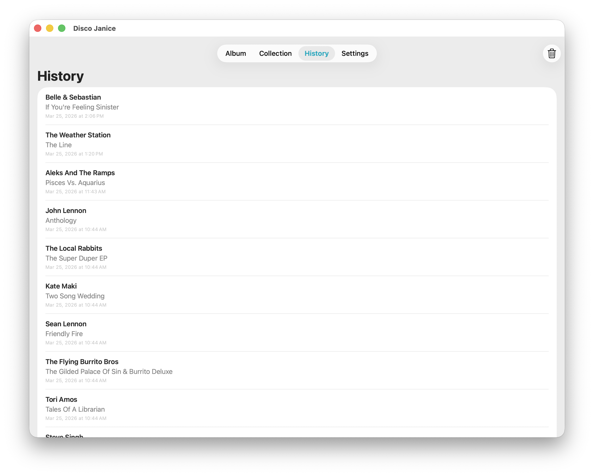

*DiscoJanice* is an app for iOS and macOS that will choose a random album from your Discogs collection.

It's called *DiscoJanice* because Disco=Discogs and Janice=Rand... as in Yoeman Janice Rand from original Star Trek, and rand being short for random. Get it???

## Features

- **Random Album** — Pick a random album from your Discogs collection with artwork and an Apple Music link
- **Smart Selection** — Albums you've picked in the past 3 days are excluded from random picks so you hear something different
- **Collection** — Browse your full Discogs collection sorted by artist, with a refresh button to sync from the API
- **History** — See every album you've selected with artist, title, and timestamp, with the option to clear your history
- **Siri Shortcut** — Ask Siri to suggest an album via App Intents
- **Ask To Play** — Have your device speak a command to Sonos or Siri to play the selected album

## Need Help?
[Create a new GitHub Issue with the question tag](https://github.com/aanklewicz/DiscoJanice/issues/new?assignees=&labels=question&projects=&template=question.md&title=).

[Create a new Issue from template](https://github.com/aanklewicz/DiscoJanice/issues/new/choose) to report a bug or request a new feature.

## Screenshots

### iOS

| Album | Collection | History |
|:---:|:---:|:---:|
|  |  |  |

### macOS

| Album | Collection | History |
|:---:|:---:|:---:|
|  |  |  |

## Examples
[Video](https://youtube.com/shorts/4Y_LSs58Bqw?si=emdO1CWZDpoB8QFM)

## Requirements

iOS 18 or higher
[Download from the App Store here](https://apps.apple.com/ca/app/discojanice/id6740820977)

## Contributing

*DiscoJanice* is an ongoing project and contributions are welcome.

## Author

Adam Anklewicz

## License

**DiscoJanice** is available under the MIT license. See the LICENSE file for more info.
