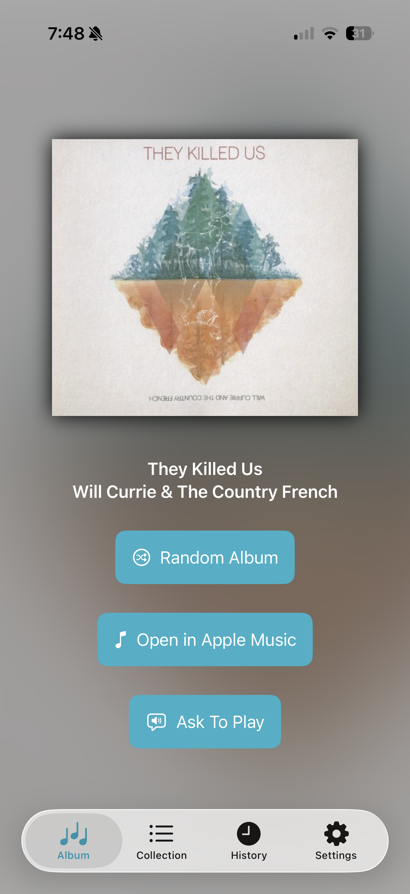
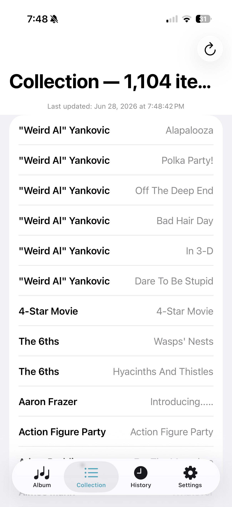
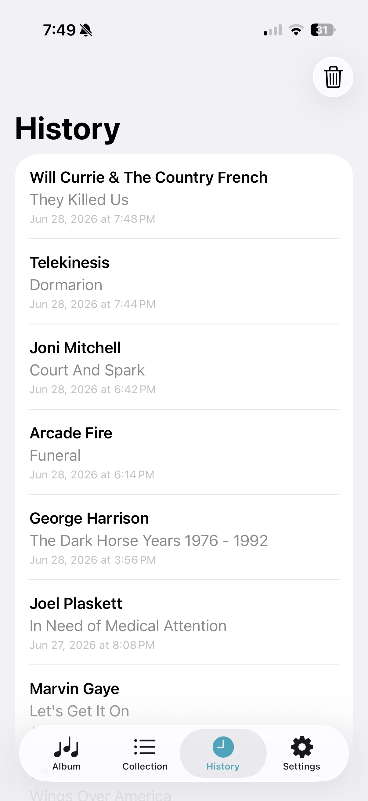
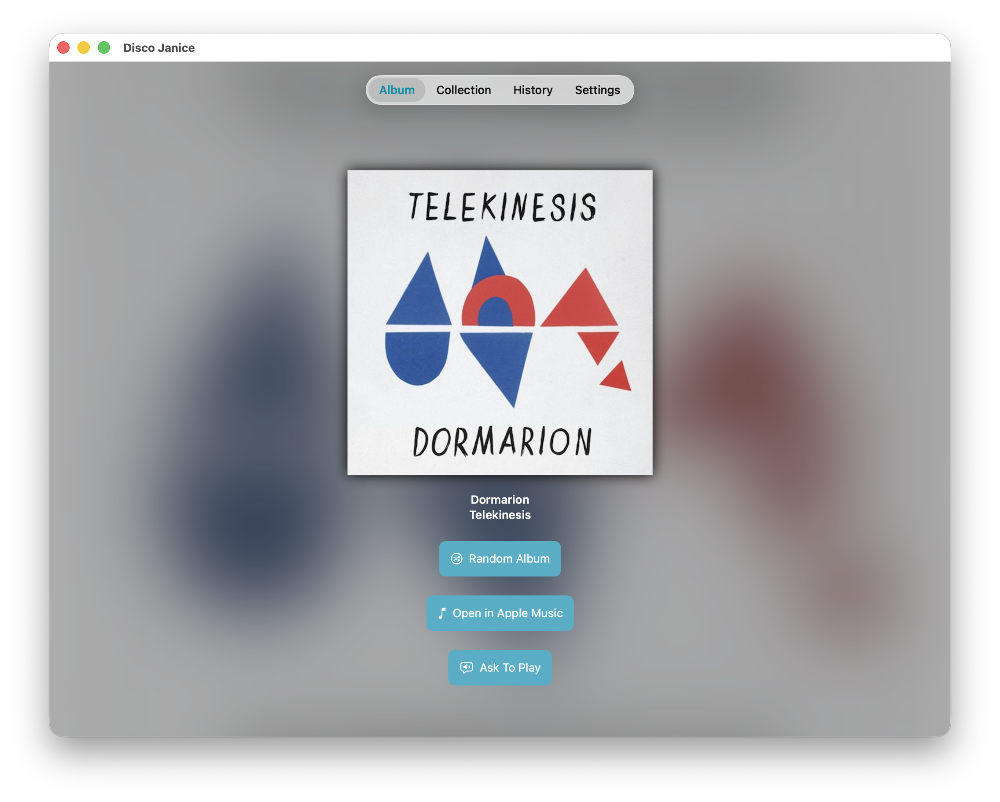
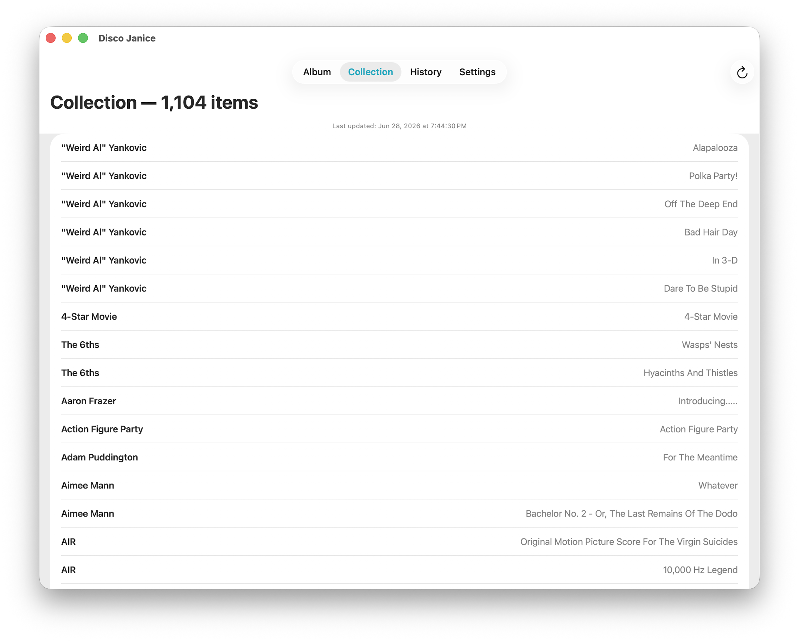
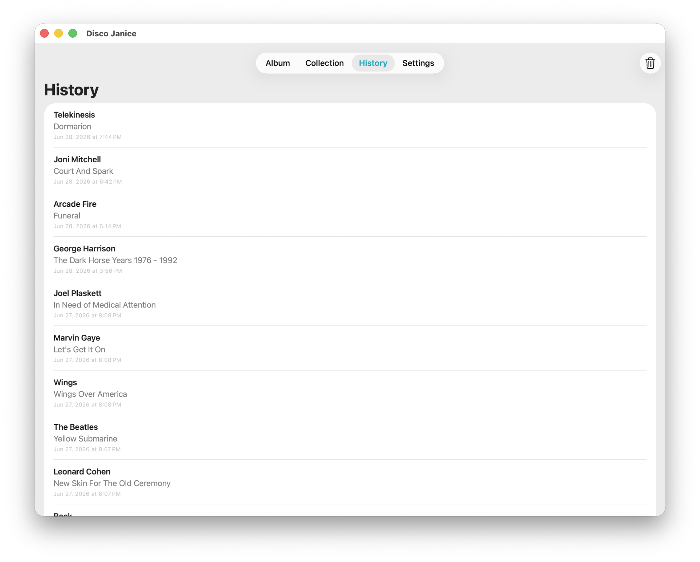

*DiscoJanice* is an app for iOS and macOS that will choose a random album from your Discogs collection.

It's called *DiscoJanice* because Disco=Discogs and Janice=Rand... as in Yoeman Janice Rand from original Star Trek, and rand being short for random. Get it???

## Features

- **Random Album** — Pick a random album from your Discogs collection with artwork, background art, and an Apple Music link
- **Smart Selection** — Recently picked albums are excluded from random picks so you hear something different. Customize the no-repeat window from 0 to 365 days in Settings
- **Collection** — Browse your full Discogs collection sorted by artist (ignoring "The", "A", "An", etc.), with an item count and a refresh button to sync from the API
- **History** — See every album you've selected with artist, title, and timestamp. Swipe an entry left to delete it or right to load it back on the Album tab, or clear the whole history
- **Siri Shortcut** — Ask Siri to suggest an album via App Intents, with selections saved to your history
- **Ask To Play** — Have your device speak a command to Sonos or Siri to play the selected album, with each integration toggled independently in Settings
- **iCloud Sync** — Settings and history sync across all your devices via iCloud

## What's New in 2.2

- **Accurate album art** — Cover art now comes straight from your Discogs collection instead of being matched through a music search, so the correct artwork shows up
- **Siri & Sonos toggles** — Turn each voice integration on or off in Settings; the Ask To Play button adapts automatically (a menu when both are on, a single button when one is on, and hidden when both are off)
- **Swipe actions in History** — Swipe an entry left to delete it, or right to load that album back on the Album tab
- **Faster Collection tab** — Large collections load and scroll smoothly
- **macOS stability fix** — Fixed a freeze that could happen when the app was left open for a long time

## What's New in 2.1

- **Background album art** — The Album tab now displays a blurred version of the cover art as a background
- **Siri history** — Albums suggested via Siri are now saved to your selection history
- **Customizable no-repeat days** — Set how many days before an album can be picked again (0–365), replacing the fixed 3-day window
- **Smarter collection sorting** — Artists are sorted ignoring leading articles (The, A, An, Le, La, Los, Die, etc.)
- **Collection item count** — The Collection tab title shows the total number of items
- **iCloud sync** — Your Discogs username, settings, and selection history now sync across all your devices

## Need Help?
[Create a new GitHub Issue with the question tag](https://github.com/aanklewicz/DiscoJanice/issues/new?assignees=&labels=question&projects=&template=question.md&title=).

[Create a new Issue from template](https://github.com/aanklewicz/DiscoJanice/issues/new/choose) to report a bug or request a new feature.

## Screenshots

### iOS

| Album | Collection | History |
|:---:|:---:|:---:|
|  |  |  |

### macOS

| Album | Collection | History |
|:---:|:---:|:---:|
|  |  |  |

## Examples
[Video](https://youtube.com/shorts/4Y_LSs58Bqw?si=emdO1CWZDpoB8QFM)

## Requirements

iOS 18 or higher
[Download from the App Store here](https://apps.apple.com/ca/app/discojanice/id6740820977)

## Contributing

*DiscoJanice* is an ongoing project and contributions are welcome.

## Author

Adam Anklewicz

## License

**DiscoJanice** is available under the MIT license. See the LICENSE file for more info.
